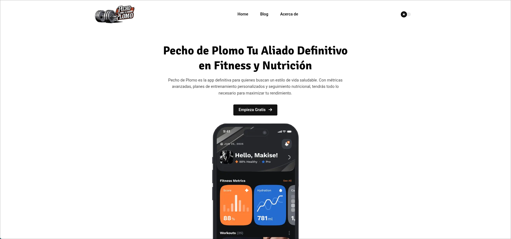

  <h1>Pecho de plomo</h1>

A static website of a fictional gym made with [hugo](https://gohugo.io/), using the [hugoplate](https://github.com/zeon-studio/hugoplate) template.This page is made for learning purposes for the Business Intelligence class.

## 📷 Screenshots

## 🎮 Demo

- [Live demo here!](https://pecho-plomo.vercel.app/)(vercel)

## ✅ TODO

- [ ] 118n in its entirety for Spanish
- [ ] clear unnecessary information

## 🙏Acknowledgments

- [zeon-studio's](https://github.com/zeon-studio/hugoplate) for template
- [strangehelix.bio](https://www.figma.com/community/file/1334779038193346013) for design

## ⚖️ License

MIT
